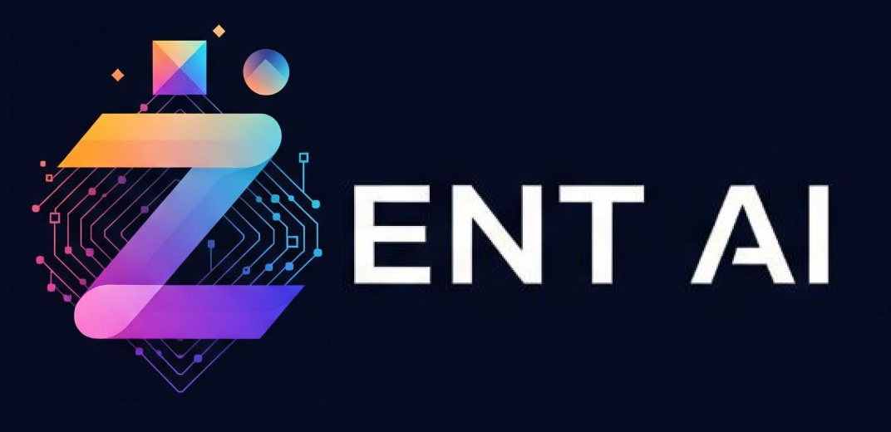

# Zent-AI: The Conversational Aptos Dashboard

Zent-AI is a modern Web3 dashboard that makes interacting with the Aptos blockchain simple. Instead of complex interfaces, just chat with our AI assistant to check balances, transfer assets, or swap tokens. Web3 becomes accessible and intuitive for everyone.

## ✨ Core Features

- **Conversational AI Interface:** Execute blockchain commands with plain English.
- **Real-Time On-Chain Data:** View the balance of any token for your wallet or any address on Aptos.
- **AI-Powered Transactions:** The AI parses your intent and prepares actions like transfers, swaps, and token price checks.
- **Wallet-First Security:** Secure routes require wallet connection for access.
- **Intelligent Feedback:** The AI asks for more info if a command is missing details.

## 🚀 Technology Stack

- **Frontend:** React, Chakra UI  
- **Blockchain Integration:** Aptos TS SDK, Aptos Wallet Adapter  
- **Backend:** Custom AI Command Processing API

## 🛠️ Getting Started

```bash
# Clone the repository
git clone <your-repository-url>
cd <repository-folder>

# Install dependencies
npm install

# Set up environment variables
echo "REACT_APP_API_URL=http://localhost:8000" > .env

# Run the application
npm start
